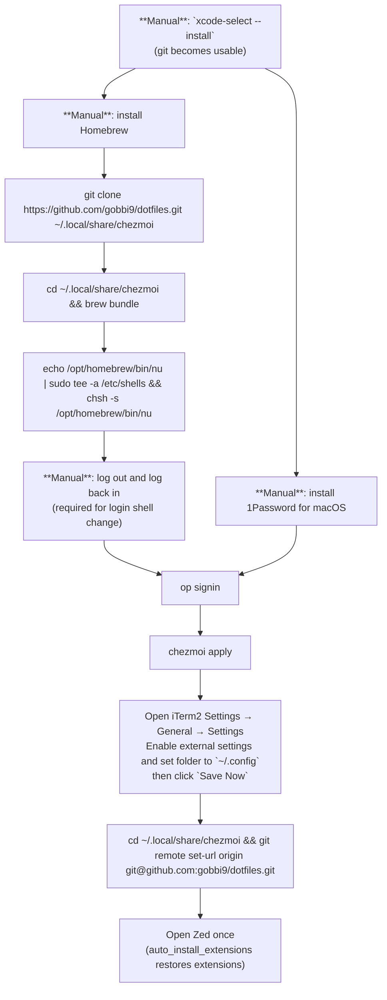

# Dotfiles with chezmoi

This repository manages personal configuration files using [chezmoi](https://www.chezmoi.io/).

The goal is to:

- version configs with Git
- back them up remotely
- keep files in their original locations
- avoid symlinks
- preserve per-app behavior
- support configs spread across multiple directories

---

## Core chezmoi model

### Why chezmoi?

Initially considered:

- bare Git repo with `--work-tree`
- symlink-based approaches (`stow`)
- plain Git repos

But each had drawbacks.

#### Bare Git repo drawbacks

Although elegant, it has poor editor UX:

- opening the repo in Zed/VSCode does not show tracked files outside repo dir
- Git tooling becomes confusing
- entire `$HOME` becomes a logical Git repo
- requires hiding untracked files
- `.gitignore` handling becomes awkward

#### Symlink drawbacks

Personally disliked because:

- hard to remember what is a symlink vs real file
- filesystem truth becomes less obvious

#### Why chezmoi won

chezmoi provides:

- normal Git repo structure
- no symlinks required
- files stay in correct target locations
- support for arbitrary filesystem paths
- explicit sync behavior
- better editor UX

### Important mental model

chezmoi has TWO SIDES:

```text
REAL FILESYSTEM
        ↕
CHEZMOI SOURCE REPO
```

You explicitly sync between them.

### Core commands

#### Pull filesystem changes INTO chezmoi repo

Meaning:

```text
filesystem -> source repo
```

Command:

```bash
chezmoi add <path>
```

Examples:

```bash
chezmoi add ~/.gitconfig
chezmoi add ~/.config/mise
```

For already-managed files:

```bash
chezmoi re-add
```

This is effectively:

> "pull changes into repo"

#### Push chezmoi repo changes TO filesystem

Meaning:

```text
source repo -> filesystem
```

Command:

```bash
chezmoi apply
```

Examples:

```bash
chezmoi apply
chezmoi apply ~/.gitconfig
```

This is effectively:

> "push repo state to machine"

#### Directional helper commands (Nushell module)

These commands are provided by the Nushell module:

- `~/Library/Application Support/nushell/modules/chezmoi-ext.nu`
- loaded from `~/Library/Application Support/nushell/config.nu`

Use `chezmoi ediff` for a simple directional summary (no line hunks, templates excluded):

```bash
chezmoi ediff
```

Output is indexed:

- `[0] ⇣ <path>`
- `[1] ⇡ <path>`

Legend:

- `⇣ <path>`: destination changed; keep local file and pull it into source repo (`chezmoi re-add <path>`)
- `⇡ <path>`: source differs from destination; push source to destination (`chezmoi apply <path>`)

Inspect one entry by index:

```bash
chezmoi ediff 0
```

This runs `chezmoi diff` only for that indexed target path.

Edit a target file by fuzzy source-name lookup (first `fd` match):

```bash
chezmoi edit iterm2.plist
```

- Uses tab completion: `chezmoi edit <TAB>` and `chezmoi edit iterm<TAB>`
- Opens the resolved target file in Zed via `zed_open --new`

Batch helpers:

```bash
chezmoi down   # re-add all ⇣ paths (templates excluded)
chezmoi up     # apply all ⇡ paths (templates excluded)
chezmoi sync   # run chezmoi down, then chezmoi up (templates excluded)
```

To inspect template-backed diffs (for example `onepasswordRead` sources), run `chezmoi diff` manually.

### Very important behavior

`chezmoi apply` can overwrite filesystem changes.

⚠️ For files rendered from 1Password templates, `chezmoi diff` resolves secret values (after 1Password authentication/biometric confirmation when required) and can print sensitive plaintext content to your terminal.

Safe workflow:

```bash
chezmoi diff
```

Then decide.

#### Keep filesystem changes

```bash
chezmoi re-add
```

#### Overwrite filesystem with repo version

```bash
chezmoi apply
```

#### Deletion caveat (important)

Deleting a file/directory from the chezmoi source repo does **not** always remove the corresponding target path in `$HOME` the way you might expect, especially for directories.

If you want to delete from both places reliably, prefer:

```bash
chezmoi destroy -r <target-path>
```

Example:

```bash
chezmoi destroy -r ~/.agents/skills/some-skill
```

`destroy` is intentionally dangerous: it permanently removes from the chezmoi source, the destination directory, and chezmoi state. Use it only when you really want full deletion (not just "stop managing").

If you only want to stop tracking a path, use:

```bash
chezmoi forget <target-path>
```

### Important confusions learned

#### Source filenames are NOT target filenames

chezmoi renames files internally:

| Real Path | Source Repo |
|---|---|
| `~/.gitconfig` | `dot_gitconfig` |
| `~/.config` | `dot_config` |
| private files | `private_*` |

These are implementation details.

Commands generally expect REAL TARGET PATHS.

Correct:

```bash
chezmoi apply ~/.gitconfig
```

Wrong:

```bash
chezmoi apply dot_gitconfig
```

### About `.chezmoiignore`

Location:

```text
~/.local/share/chezmoi/.chezmoiignore
```

Paths are relative to chezmoi source repo structure, NOT relative to `~`.

Example:

```gitignore
private_Library/private_Application Support/nushell/history.txt
```

NOT:

```gitignore
~/Library/Application Support/nushell/history.txt
```

### Useful commands

#### Show differences

```bash
chezmoi diff
```

#### Show managed files with differences

```bash
chezmoi status
```

#### Show directional summary (custom)

```bash
chezmoi ediff
```

#### Show diff for one indexed directional entry

```bash
chezmoi ediff 0
```

#### Open a target file from source-name search (custom)

```bash
chezmoi edit iterm2.plist
```

#### Show managed files

```bash
chezmoi managed
```

#### Show dangling target paths from deleted/renamed chezmoi history

```bash
chezmoi dangling
chezmoi dangling prune --dry-run
chezmoi dangling prune
```

#### Dry run apply

```bash
chezmoi apply --dry-run
```

#### Remove file from chezmoi management

```bash
chezmoi forget <path>
```

Example:

```bash
chezmoi forget "~/Library/Application Support/nushell/history.txt"
```

### Notes

- chezmoi is NOT a live sync system
- it does NOT automatically watch files
- sync direction is explicit
- source repo is considered canonical state
- runtime/cache/history files should usually be ignored

---

## Managed state (what this repo tracks)

### Individual files

```text
~/.gitconfig
~/.testcontainers.properties
~/.config/starship.toml
~/.config/gh/config.yml
~/.ssh/allowedSigners
~/.ssh/config
~/.ssh/known_hosts
~/.config/scans/scans.csv (rendered from 1Password template)
~/.config/scans/all-tags.txt (rendered from 1Password template)
~/Library/Preferences/com.apple.symbolichotkeys.plist (macOS keyboard shortcuts)
~/Library/Preferences/NSUserDictionaryReplacementItems.plist (rendered from 1Password template for macOS text replacements)

and many others I am too lazy to list
```

starship.toml: on commit hash 74f7232 a big change was made, brackets from default preset were replaced with spaces, if you want to use brackets you can revert to that commit.

### Managed directories

```text
~/.config/mise
~/Library/Application Support/nushell
```

Ignored inside nushell:

```text
history.txt
```

---

## Zed configuration & extensions

Use this repo to fully restore your Zed setup on a new machine.

### Files to track

Track these global Zed config files:

```text
~/.config/zed/settings.json
~/.config/zed/keymap.json
~/.config/zed/tasks.json
~/.config/zed/snippets/
~/.config/zed/themes/
```

The helper script below syncs these paths into chezmoi automatically (no manual `chezmoi add` needed for Zed files).

Notes:

- `tasks.json`, `snippets/`, and `themes/` are optional (only add if you use them).
- Do **not** track `~/Library/Application Support/Zed/extensions/installed` (runtime artifacts, machine-local).

### Tracking installed extensions (portable way)

Track extension IDs through `settings.json` using `auto_install_extensions`.

This repo includes a Nushell command:

```text
zed sync
```

It reads currently installed Zed extensions and then does everything end-to-end:

```text
1) updates ~/.config/zed/settings.json -> auto_install_extensions
2) runs: chezmoi add ~/.config/zed/settings.json
3) runs: chezmoi add ~/.config/zed/keymap.json   (if present)
4) runs: chezmoi add ~/.config/zed/tasks.json    (if present)
5) runs: chezmoi add ~/.config/zed/snippets      (if present)
6) runs: chezmoi add ~/.config/zed/themes        (if present)
```

#### Usage

From repo root:

```nu
zed sync --dry-run
zed sync
```

Then commit/push as usual.

The script is idempotent:

- it rewrites `settings.json` only when `auto_install_extensions` actually changed
- it is safe to rerun after every extension install/remove
- it only runs `chezmoi add` for paths that exist (optional paths are skipped when missing)

### New machine restore flow (Zed)

```bash
cd ~/.local/share/chezmoi
chezmoi apply
```

Then open Zed once. Zed reads `auto_install_extensions` and installs listed extensions automatically.

### Zed agent instructions vs skills

Language/framework preference docs were originally placed under `~/.agents/skills/*-preferences`. That was changed on purpose:

- `skills/` is now reserved for true on-demand capabilities (for example `git-commit-push`).
- Always-applicable coding guidance now lives in:

```text
~/.agents/instructions/
```

Current instruction packs:

```text
~/.agents/instructions/go-preferences/
~/.agents/instructions/gradle-preferences/
~/.agents/instructions/javascript-preferences/
~/.agents/instructions/jvm-preferences/
~/.agents/instructions/kotlin-preferences/
~/.agents/instructions/typescript-preferences/
```

Why this split:

- keeps semantic separation clear (on-demand skill vs baseline instruction)
- avoids pretending preference documents are slash-command skills
- supports a lazy-load protocol in `~/.config/zed/AGENTS.md` so language-specific guidance is only loaded when matching project signals are present

Important note:

- `~/.agents/instructions/` is a personal/project convention, not an official Zed convention.
- Zed currently does not provide an official built-in mechanism to lazily load additional instruction files for `AGENTS.md`.
- The lazy-loading behavior described here is implemented as an instruction policy for agents to follow, not a guaranteed eager-vs-lazy loader feature of Zed itself.

Migration note:

- old `~/.agents/skills/*-preferences` entries were removed from chezmoi-managed state with `chezmoi destroy`.

---

## macOS settings

To track selected macOS settings, this repo includes the Nushell command:

```text
macos settings sync
```

It syncs two settings groups:

```text
1) Keyboard shortcuts
   - defaults export com.apple.symbolichotkeys -
   - writes ~/Library/Preferences/com.apple.symbolichotkeys.plist (only if changed)
   - runs: chezmoi add ~/Library/Preferences/com.apple.symbolichotkeys.plist

2) Text replacements
   - extracts only NSUserDictionaryReplacementItems from the global preferences domain
   - writes ~/Library/Preferences/NSUserDictionaryReplacementItems.plist (only if changed)
   - ensures private_Library/Preferences/private_NSUserDictionaryReplacementItems.plist.tmpl exists
   - uploads the extracted key plist to 1Password as op://Personal/macos-text-replacements/NSUserDictionaryReplacementItems.plist
```

Text replacements are treated as sensitive because System Settings → Keyboard → Text Replacements can contain private snippets. The repo commits only a `onepasswordRead` template for the extracted `NSUserDictionaryReplacementItems` key:

```tmpl
{{ onepasswordRead "op://Personal/macos-text-replacements/NSUserDictionaryReplacementItems.plist" }}
```

The plaintext source path `private_Library/Preferences/private_NSUserDictionaryReplacementItems.plist` is blocked by `.gitignore`.

### Usage

From repo root:

```nu
macos settings sync --dry-run
macos settings sync
```

You can sync only one group when needed:

```nu
macos settings sync --skip-text-replacements
macos settings sync --skip-keyboard-shortcuts
```

Before the first text replacement upload, create a 1Password item named `macos-text-replacements` in the `Personal` vault, or pass another file reference with `--text-replacements-op-ref`.

After changing macOS keyboard shortcuts or text replacements in System Settings, re-run the script and commit.

On a new Mac, run `chezmoi apply` to render the 1Password-backed key plist locally, then write only that key into macOS global preferences:

```nu
chezmoi apply
macos settings sync --restore-text-replacements
```

If shortcuts or text replacements do not refresh immediately, log out/in (or reboot).

---

## Secrets and 1Password

### Push local files back to 1Password (for `onepasswordRead` templates)

Templates like:

- `dot_config/scans/scans.csv.tmpl`
- `dot_config/scans/all-tags.txt.tmpl`
- `private_Library/Preferences/private_NSUserDictionaryReplacementItems.plist.tmpl`

use `onepasswordRead "op://..."` references.

Important: `onepasswordRead` is read-only from chezmoi's perspective (1Password -> rendered local file). If you changed a local rendered file and want that change in 1Password, run the Nushell command:

```nu
op push --dry-run
op push
chezmoi apply # for tmpl files choose "overwrite" to update chezmoi state
chezmoi diff # should not output anything
```

What it does:

- scans all `*.tmpl` files in the chezmoi source directory
- extracts every `onepasswordRead` `op://...` reference
- resolves each template's local target via `chezmoi target-path`
- reads the local target file content
- updates standard fields by exact `id`/`label` via item JSON template edits
- if the ref points to a file attachment (for example `all-tags.txt`), updates it via escaped `[file]` assignment so dotted names are handled correctly

Behavior:

- `--dry-run` prints intended updates only
- in apply mode, the script prints each `op://...` ref before any `op` call (before biometric prompt)
- works for new templates automatically (no hardcoded scans paths)
- skips missing local target files with warnings
- exits non-zero if any update fails

### Public repo safety notes

This dotfiles repo is designed to be shareable/public.

- Secrets are managed via 1Password at runtime (not committed in this repo).
- `~/.config/scans/scans.csv`, `~/.config/scans/all-tags.txt`, and `~/Library/Preferences/NSUserDictionaryReplacementItems.plist` are managed via chezmoi templates that call `onepasswordRead`.
- Raw source copies (`dot_config/scans/scans.csv`, `dot_config/scans/all-tags.txt`, and `private_Library/Preferences/private_NSUserDictionaryReplacementItems.plist`) are blocked by `.gitignore`; sensitive runtime/auth files are also blocked by `.chezmoiignore` where appropriate.
- Sensitive/runtime files are explicitly blocked by both `.chezmoiignore` (apply scope) and `.gitignore` (commit scope).
- Keep `~/.config/gh/config.yml` tracked, but do **not** track `~/.config/gh/hosts.yml` (contains auth tokens).
- Do **not** commit private keys (for example `~/.ssh/id_*`); only public material/config is tracked here.

---

## Machine lifecycle (bootstrap, setup, daily use)

### New Mac bootstrap order (dependency-first)

Verified for this repo:

- `brew` is a manual bootstrap dependency (not preinstalled on macOS).
- `1password-cli` is installed later by `brew bundle` (already listed in `Brewfile`).
- `op` authentication is required before workflows that resolve `onepasswordRead` templates.



Note: `git clone https://...` keeps full git history; the later `git remote set-url` step only switches `origin` from HTTPS to SSH.

⚠️ `mise trust` must be manually run for repos that have a mise.toml, there is no easy way to track the trusted mise projects.

### Homebrew Bundle (`Brewfile`)

The repo includes a `Brewfile` in the repo root (`~/.local/share/chezmoi/Brewfile`).

#### Update `Brewfile` from current machine

From the repo root:

```bash
cd ~/.local/share/chezmoi
brew bundle dump --force
```

#### Import/install from `Brewfile`

On a new or existing machine:

```bash
cd ~/.local/share/chezmoi
brew bundle
```

Optional check-only mode:

```bash
brew bundle check
```

### Setup (initial repository bootstrap)

Install:

```bash
brew install chezmoi
```

Initialize:

```bash
chezmoi init
```

Add ignore rule:

```nu
"private_Library/private_Application Support/nushell/history.txt" | save -f ~/.local/share/chezmoi/.chezmoiignore
```

Add files:

```bash
chezmoi add ~/.gitconfig
chezmoi add ~/.testcontainers.properties
chezmoi add ~/.config/starship.toml
chezmoi add ~/.config/gh/config.yml
chezmoi add ~/.ssh/allowedSigners
chezmoi add ~/.ssh/config
chezmoi add ~/.ssh/known_hosts
```

Add directories:

```bash
chezmoi add ~/.config/mise
chezmoi add "~/Library/Application Support/nushell"
```

Test editing a file directly inside source repo:

```text
~/.local/share/chezmoi
```

Check differences:

```bash
chezmoi diff
```

Apply source repo changes to filesystem:

```bash
chezmoi apply
```

Commit:

```bash
git cm "Setup dotfiles"
```

Create GitHub repo:

```bash
gh personal repo create gobbi9/dotfiles --private --source=. --remote=origin --push
```

### Recommended workflow

#### Daily usage

Edit real files normally:

```text
~/.config/mise/config.toml
~/Library/Application Support/nushell/config.nu
```

Then periodically:

```bash
chezmoi diff
chezmoi re-add
git commit
git push
```

Tip: run `dotfiles` (or alias `d`) in Nushell to list available dotfiles helper commands and aliases.

#### Nushell ad-hoc scripts (non-interactive)

For non-interactive Nushell heredoc runs, use:

```shell
cat <<'NU' | /opt/homebrew/bin/nu -n /dev/stdin
source '/Users/gobbi/Library/Application Support/nushell/config.nu'
<NU_SCRIPT>
NU
```

Notes:
- `-n` skips normal Nushell startup; only what is explicitly `source`d runs.
- With the current config, this flow does **not** initialize Starship prompt hooks (`starship.nu`) and does not run prompt rendering.
- Any inherited `STARSHIP_*` environment variables may still be present from the parent shell; that alone does not mean Starship initialized in this process.

This is the preferred way for Agents to run Nushell scripts that do not require interactive input.

#### New machine / restore workflow

```bash
git pull
chezmoi apply
```

##### Restore iTerm2 settings from chezmoi-managed `~/.config/com.googlecode.iterm2.plist`

After `chezmoi apply` has created `~/.config/com.googlecode.iterm2.plist`, configure iTerm2 to read from that file location:

1. Open iTerm2.
2. Go to `iTerm2 → Settings... → General → Settings`.
3. Enable `Load settings from a custom folder or URL`.
4. Set the folder path to `~/.config` (or `/Users/<your-user>/.config`).
5. Confirm the green check appears, then click `Save Now`.

Notes:
- iTerm2 reads the plist by filename, so the folder must contain `com.googlecode.iterm2.plist`.
- If settings do not immediately reflect, quit and reopen iTerm2.

---

## Repository location

chezmoi source repo:

```text
~/.local/share/chezmoi
```

This is a normal Git repo and works well with editors like Zed.

---

## App icon overrides (`macos icons`)

Custom app icons are loaded from:

```text
~/.config/app-icons
```

Supported source files:

- `<AppName>.png` (preferred)
- `<AppName>.icns`

If both exist for the same app name, `.png` is preferred.

### Usage

List detected icons:

```nu
macos icons list
```

Apply one app icon:

```nu
macos icons apply Notion
```

Apply all app icons:

```nu
macos icons apply
```

Preview changes without applying:

```nu
macos icons apply --dry-run
```

### Important reminder

When an app is updated (for example via Homebrew, App Store, or in-app updater), its custom icon can be reset.

After each app update, run `macos icons apply` again to overwrite/reapply your custom icons.

Also, for visual refresh in Dock/Finder:

- Close running app instances
- Remove the app from Dock
- Reopen the app and re-add it to Dock
